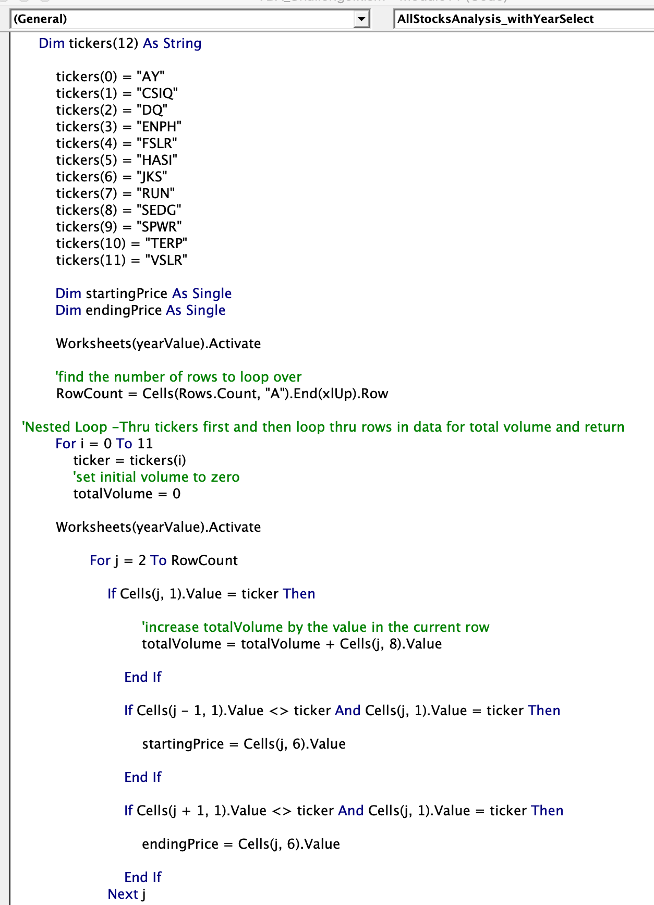
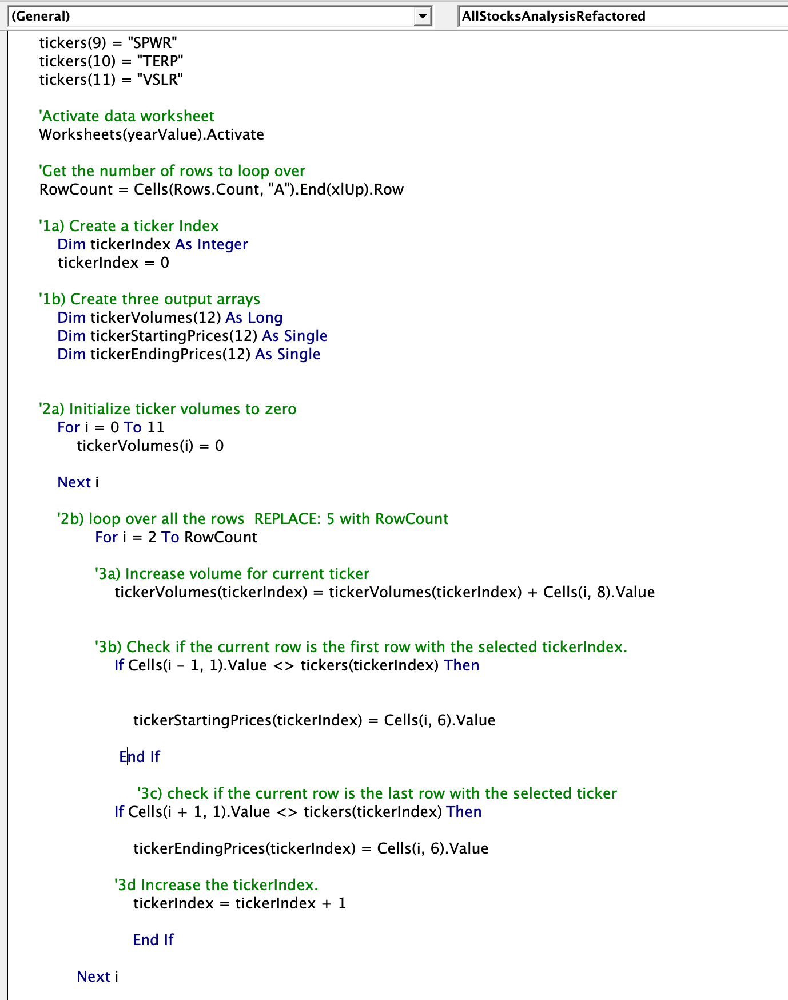
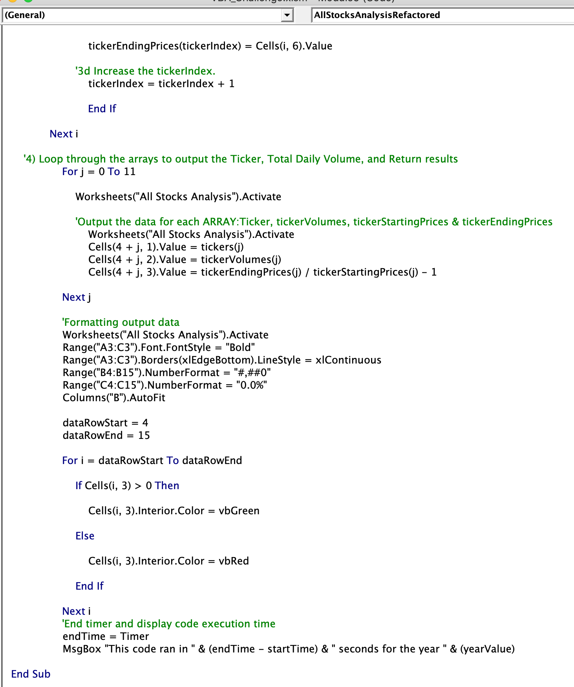
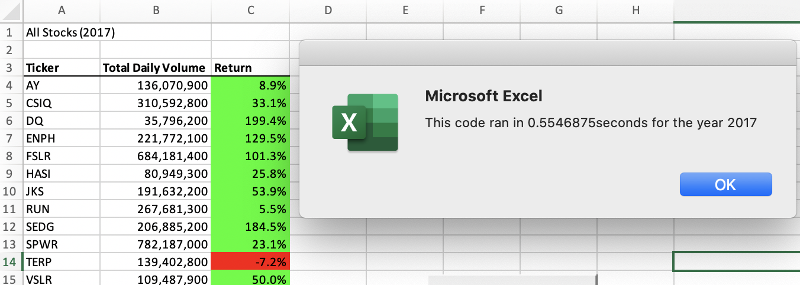
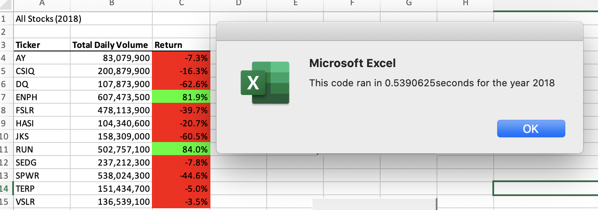
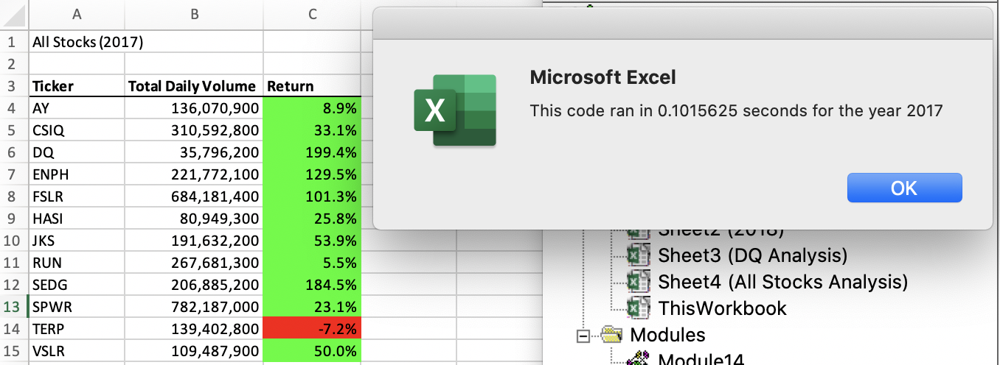
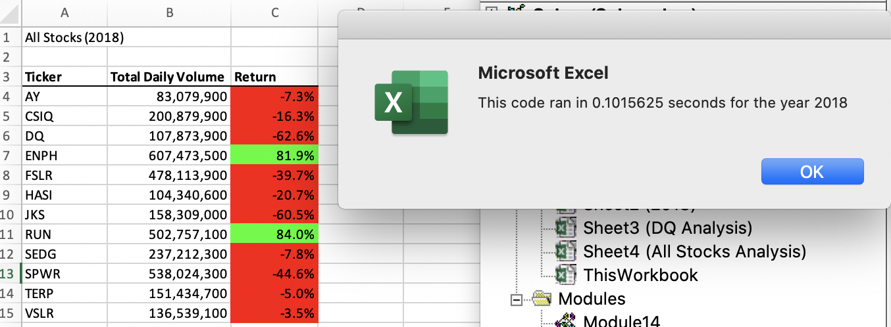

#   **Module 2 Challenge: Refactoring VBA Code**

##  Overview of Project: 
This project demonstrates how refactoring existing code can improve and optimize its execution and reduce the time it takes to execute by using more efficient code.

### Explain the purpose of this analysis.
The purpose of our project is to make the VBA code we wrote to analyze our stock volume and price data more efficient and run faster so that it can be used to analyze much larger stock data sets, without straining the computing resources or time limitations. After writing initial VBA code where we used two "for" loops and several conditional statements to add up the trading volume for each stock by year, we refactored the VBA script to produce the same output in less time. The refactored code added 3 arrays to the original code and used an index variable to iterate through the stock dataset once instead of multiple times and output the annual trading volume and annual stock performance for each stock. The index variable is used to access the corresponding data for each different stock in the stock ticker index and the loop collects the required output data more efficiently. This refactoring of the code makes it possible to run the analysis faster, even though the output results and functionality of the code do not change.

##  Results: 
### Using images and examples of your code, compare the stock performance between 2017 and 2018, as well as the execution times of the original script and the refactored script.

 

 
 
 
 
The original code we wrote to analyze the stock dataset executed in between 0.53 and 0.56 seconds, for the 2017 and 2018 stock dataset:

 

 

 
 

 while the refactored VBA code executed in slightly over 0.10 seconds, for both years.  

 
 

 
  This is significant improvement, an 81% drop in execution time.
Using an array(index) to find and store the daily trading volume and closing stock prices for each stock, improves the efficiency of the operations and this makes it possible to reduce the time to run.

##  Summary: 

### In a summary statement, address the following questions.

##### What are the advantages or disadvantages of refactoring code?
### Advantages of refactoring code include:
* reducing the time and system resources required to run code
* identifying, reducing and avoiding bugs that could be time consuming and expensive to fix later 
* make it easier for multiple people to work with and undesrtand the code, when they are maintaining or adding to the code 
 
* understanding the data, code and the processes it created better
### The disadvantages could include
* the time and effort it takes to identify, write, test and produce the refactored code
* opportunity cost of not spending time working on something that generates revenue or creates new code

##### How do these pros and cons apply to refactoring the original VBA script?